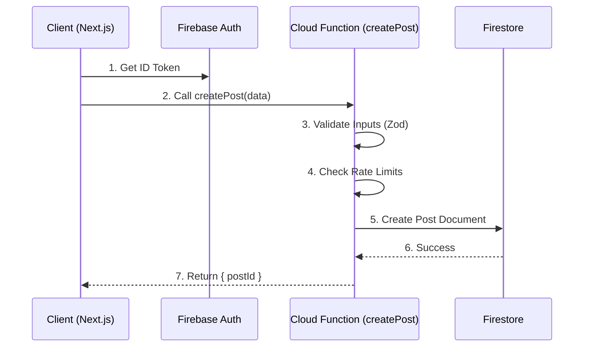
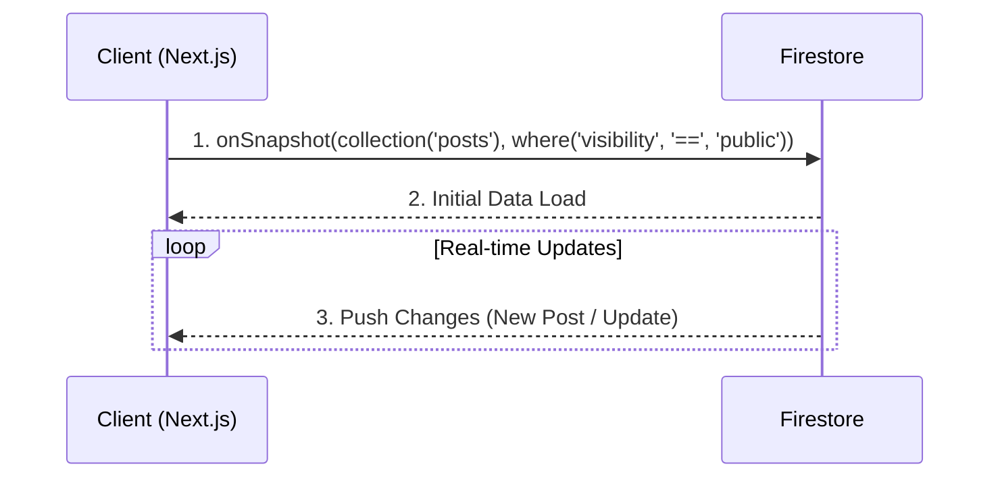

# 10_ARCHITECTURE.md - NADU System Architecture
_Status: GOLD_

This document details the high-level architecture and data flow for the NADU application.

## 1. High-Level Overview

NADU is built as a **Serverless**, **Event-Driven** application on the Google Cloud Platform (GCP) via Firebase.

### Core Stack
- **Frontend**: Next.js (React) hosted on Vercel/Firebase Hosting.
- **Backend Logic**: Firebase Cloud Functions (Node.js).
- **Database**: Cloud Firestore (NoSQL).
- **Auth**: Firebase Authentication.
- **Storage**: Cloud Storage for Firebase.

## 2. Security Model: "Client Reads, Server Writes"

To ensure data integrity and prevent abuse, we adhere to a strict security model:

1.  **Client Reads (Direct)**
    - The frontend reads data directly from Firestore using the Client SDK (`onSnapshot`, `getDoc`).
    - **Firestore Security Rules** enforce *who* can see *what*.
    - Example: `allow read: if request.auth != null && resource.data.visibility == 'public';`

2.  **Server Writes (Indirect)**
    - The frontend **CANNOT** write to core collections (`posts`, `users`, `chats`) directly.
    - All mutations are performed by calling **Callable Cloud Functions**.
    - This allows for complex validation, rate limiting, and side-effects (e.g., sending notifications) to happen securely on the server.

## 3. Data Flow Diagrams

### 3.1. Creating a Post

### 3.2. Reading the Feed

## 4. Key Components

### 4.1. Authentication & Identity
- **Trigger**: `onUserCreate` (Auth) -> Creates `users/{uid}` doc.
- **Custom Claims**: used for roles (`admin`, `moderator`) and verification status (`isVerified`).
- **Anonymity**: The system supports "Anonymous Posting" but NOT anonymous users. Every action is traceable to a registered `uid` internally.

### 4.2. Trust & Safety (Moderation)
- **Reporting**: Users report content -> `createReport` function.
- **Resolution**: Admins resolve reports -> `resolveReport` function.
- **Audit**: All actions logged to `moderationActions` collection.

## 5. Scalability Considerations

- **Denormalization**: We duplicate author data (`displayName`, `photoURL`) on Posts and Comments to avoid "N+1" reads.
- **Sharding**: (Future) Counters like `likeCount` will need distributed counters if traffic spikes.
- **Cold Starts**: Cloud Functions may have cold starts; we use `minInstances` for critical paths if needed (Phase 2).
